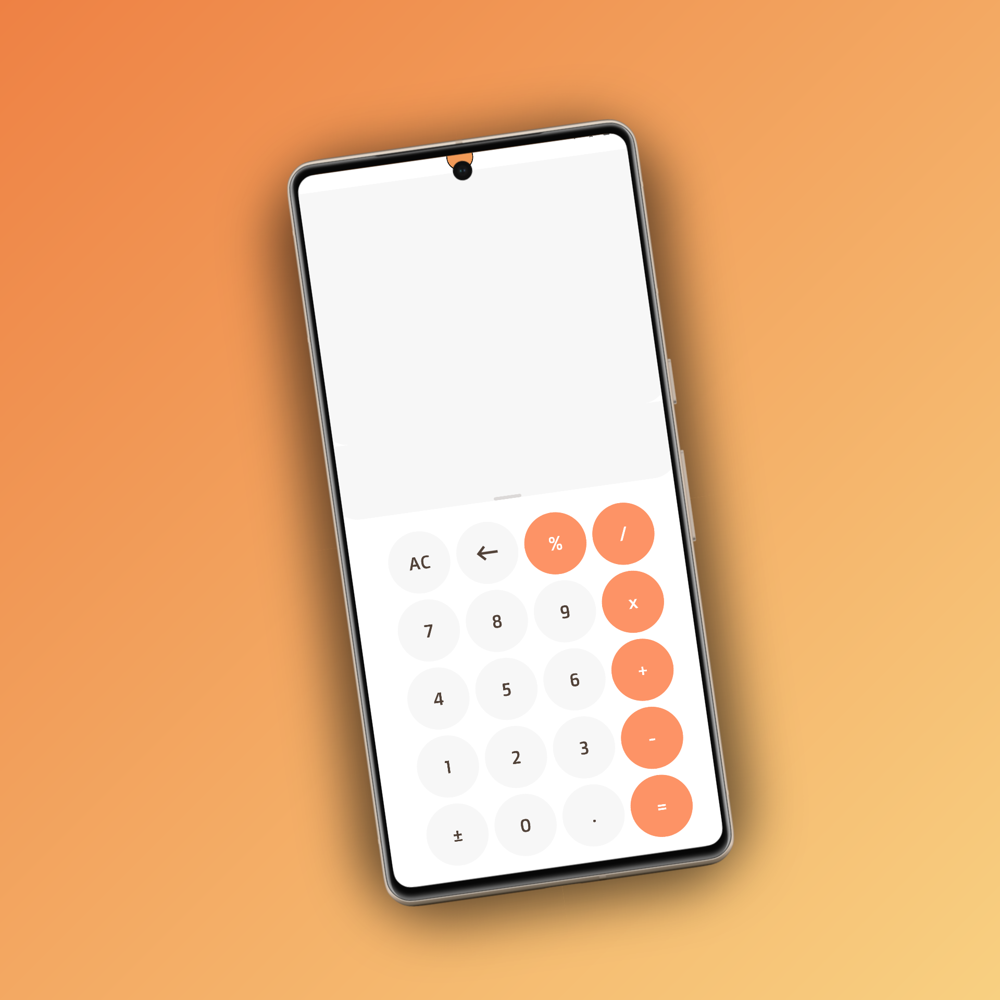
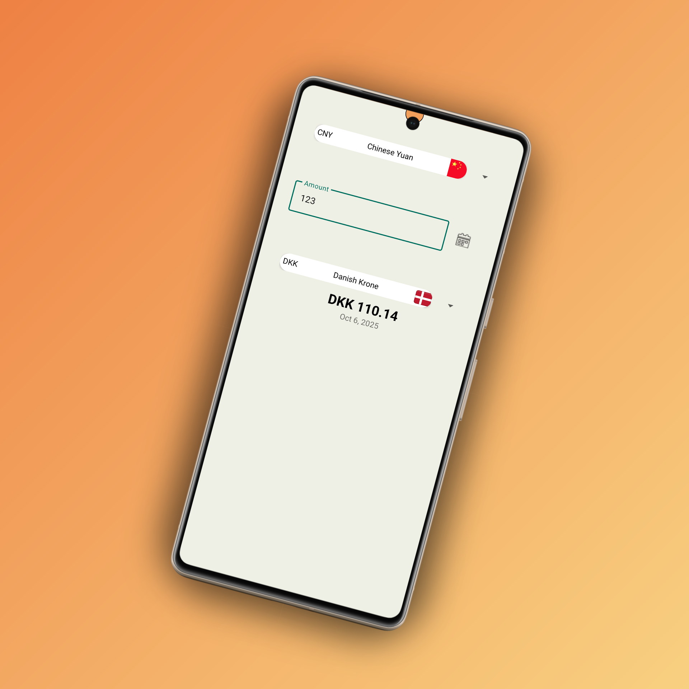

# 👋 Hi, I'm Mohamed shemees
Welcome to my portfolio! I create Android and web apps with a focus on design, performance, and usability.

---

<section class="project project-weather">
  

    <h3>🌤️ Weather App</h3>
    
A sleek weather forecast app that shows current conditions and 7-day trends.

    <a href="https://github.com/mohamedshemees/MyWeatherApp">View on GitHub</a>
  

  

    
    <video autoplay loop muted playsinline class="app-gif">
      <source src="assets/weather_demo.webm" type="video/webm" />
    </video>
  

</section>

<section class="project project-calculator">
  

    <h3>🧮 Calculator App</h3>
    
Simple and intuitive calculator with a modern UI built using HTML, CSS, and JS.

    <a href="#">View on GitHub</a>
  

  

    
    <video autoplay loop muted playsinline class="app-gif">
      <source src="assets/calculator_demo.webm" type="video/webm" />
    </video>
  

</section>

<section class="project project-currency">
  

    <h3>💱 Currency Exchange App</h3>
    
Instantly convert between global currencies with real-time exchange rates.

    <a href="https://github.com/mohamedshemees/CurrencyX">View on GitHub</a>
  

  

    
    <video autoplay loop muted playsinline class="app-gif">
      <source src="assets/currency_demo.webm" type="video/webm" />
    </video>
  

</section>

<link rel="stylesheet" href="assets/css/style.css">
