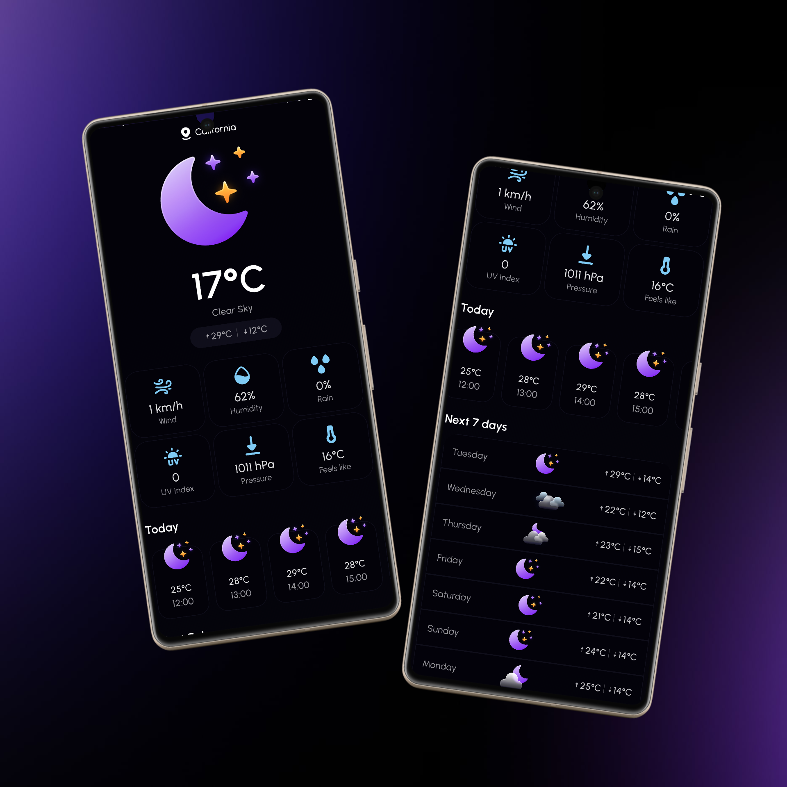

# 👋 Hi, I'm Mohamed shemees
Welcome to my portfolio! I create Android and web apps with a focus on design, performance, and usability.

---

  

    <h3>🌦️ Weather App</h3>
    
A modern weather application that provides live forecasts and smooth animations.

    
<a href="https://github.com/mohamedshemees/MyWeatherApp" target="_blank">View source on GitHub →</a>

  

  

    
    <video class="app-gif" autoplay loop muted playsinline>
    <source src="assets/weather_demo.webm" type="video/webm">
    Your browser does not support the video tag.
    </video>
  

  

  

    
    <video class="app-gif" autoplay loop muted playsinline>
      <source src="assets/calculator_demo.webm" type="video/webm">
      Your browser does not support the video tag.
    </video>
  

  

    <h3>Calculator App</h3>
    
 🧮 A sleek, minimal calculator built for smooth usability and crisp animations. Designed for daily calculations with a modern look.

    
<a href="https://github.com/mohamedshemees/MyCalculatorApp" target="_blank">View source on GitHub →</a>

  

<section id="currency-app" class="app-section currency-theme">
  <h2 class="section-title">💱 Currency Exchange App</h2>
  

    A modern currency exchange app that provides live conversion rates between major world currencies. Built with Kotlin and powered by real-time APIs.
  

 
<a href="https://github.com/mohamedshemees/CurrencyX" target="_blank">View source on GitHub →</a>

  

    
    <video class="app-gif" autoplay loop muted playsinline>
      <source src="assets/currency_demo.webm" type="video/webm">
      Your browser does not support the video tag.
    </video>
  

</section>

<link rel="stylesheet" href="assets/css/style.css">
