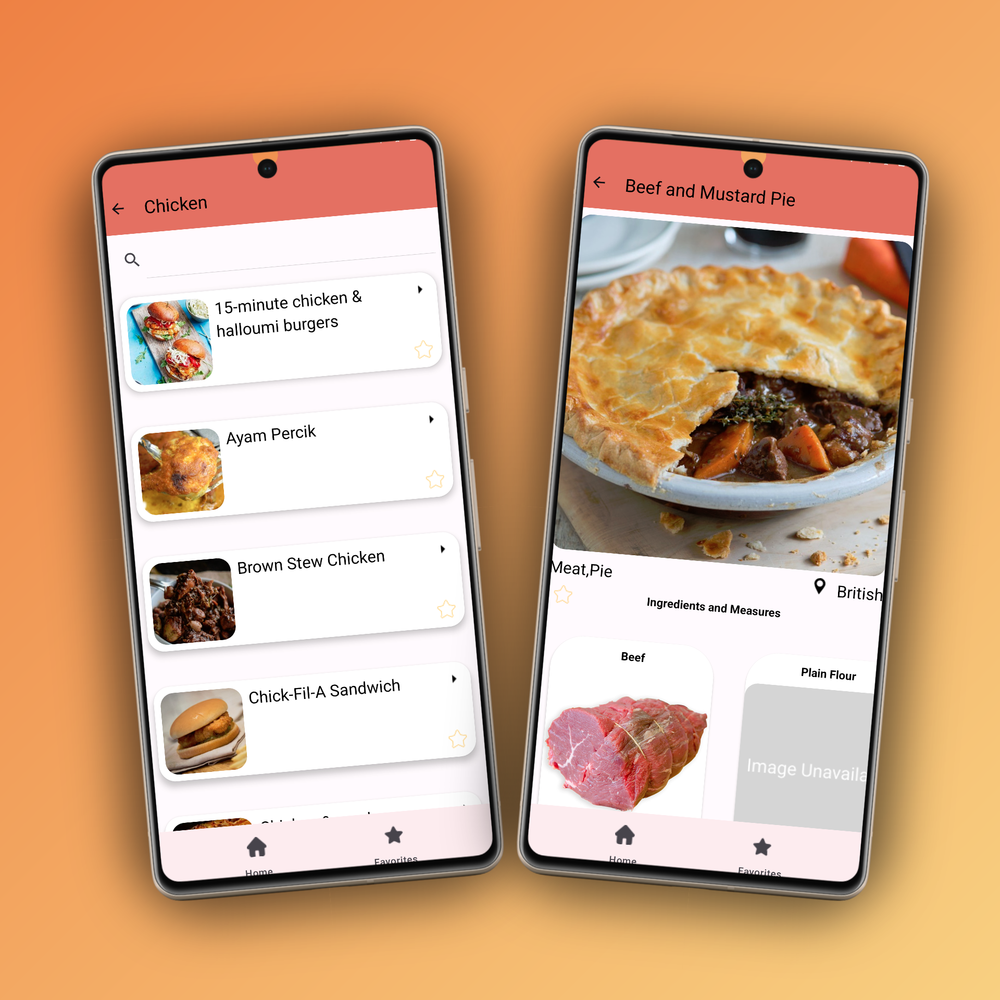

<section class="project project-weather">
  

    <h3>🌤️ Weather App</h3>
    
A sleek weather forecast app that shows current conditions and 7-day trends.

    <a href="https://github.com/mohamedshemees/MyWeatherApp">View on GitHub</a>
  

  

    
    <video autoplay loop muted playsinline class="app-gif">
      <source src="assets/weather_demo.webm" type="video/webm" />
    </video>
  

</section>

<section class="project project-calculator">
  

    <h3>🧮 Calculator App</h3>
    
Simple and intuitive calculator with a modern UI built using HTML, CSS, and JS.

    <a href="#">View on GitHub</a>
  

  

    
    <video autoplay loop muted playsinline class="app-gif">
      <source src="assets/calculator_demo.webm" type="video/webm" />
    </video>
  

</section>

<section class="project project-currency">
  

    <h3>💱 Currency Exchange App</h3>
    
Instantly convert between global currencies with real-time exchange rates.

    <a href="https://github.com/mohamedshemees/CurrencyX">View on GitHub</a>
  

  

    
    <video autoplay loop muted playsinline class="app-gif">
      <source src="assets/currency_demo.webm" type="video/webm" />
    </video>
  

  
  <!-- Mealz App -->
  <section class="project project-mealz">
    

      <h3>Mealz App</h3>
      
A delightful food recipe explorer featuring categorized dishes, cooking steps, and nutrition details — perfect for home chefs.

    

    

      
      
      <video class="app-gif" autoplay loop muted playsinline>
        <source src="assets/mealz_demo.mp4" type="video/mp4">
        Your browser does not support the video tag.
      </video>
    

  </section>
</section>
